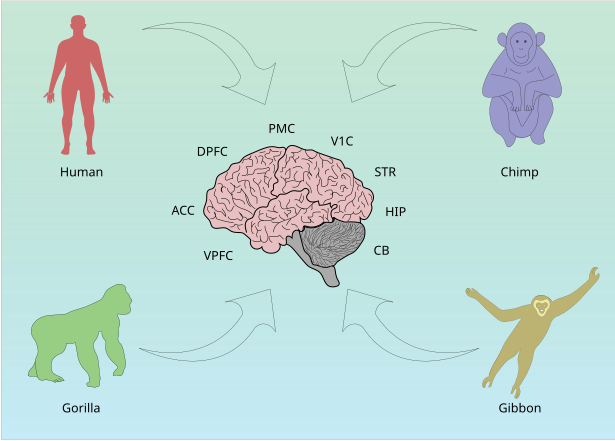

<p align="center">
  
</p>

<h1 align="center">PrimBrainLnc</h1>

<p align="center">
  <a href="http://primbrainlnc.bio.uni-mainz.de/"></a>
  <a href="https://doi.org/10.1038/s41597-024-03380-3"></a>
  
  
</p>

<p align="center">
A database of brain lncRNAs from human and non-human primates across multiple brain regions.
</p>

<p align="center">
  <b>Live database:</b> <a href="http://primbrainlnc.bio.uni-mainz.de/">primbrainlnc.bio.uni-mainz.de</a>
</p>

## Publication

Navandar, M., Vennin, C., Lutz, B., and Gerber, S. Long non-coding RNAs expression and regulation across different brain regions in primates. *Sci Data* 11, 545 (2024).
[https://doi.org/10.1038/s41597-024-03380-3](https://doi.org/10.1038/s41597-024-03380-3)

---

## Getting the code

```bash
git clone git@github.com:NavandarM/PrimBrainLnc.git
# or
git clone https://github.com/NavandarM/PrimBrainLnc.git
```

## Setup

```bash
conda create -n primbrainlnc -c bioconda -c conda-forge python=3.9 blast bedtools
conda activate primbrainlnc
pip install -r requirements.txt
```

> `requirements.txt` is included in the repo and lists all Python dependencies. BLAST and BEDTools are installed from the `bioconda` channel and used for the sequence-search feature.

## Running the server

```bash
python manage.py runserver 0.0.0.0:8000
```

## Running tests

```bash
python manage.py test Application
```

Tests run against small fixture data (`Application/tests/fixtures`) rather than the real multi-MB static files, so they're fast and don't touch the production database. The BLAST integration test is skipped automatically if `makeblastdb`/`blastn` aren't on `PATH`.
